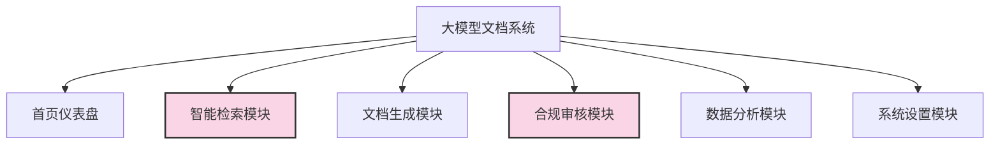
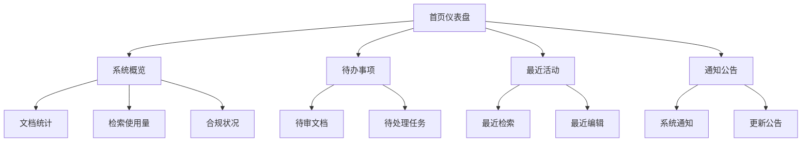
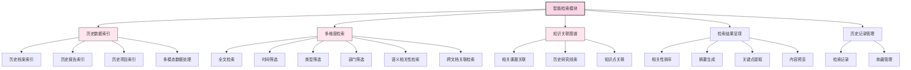
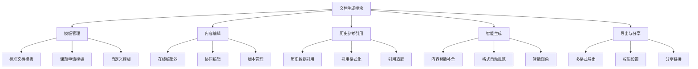
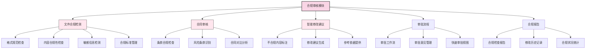
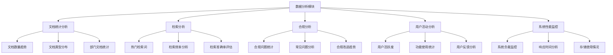
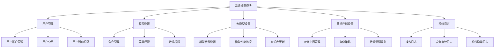
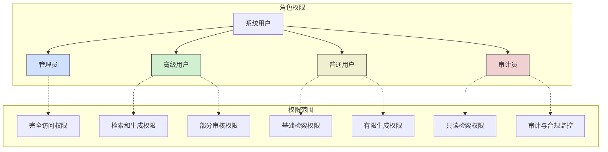
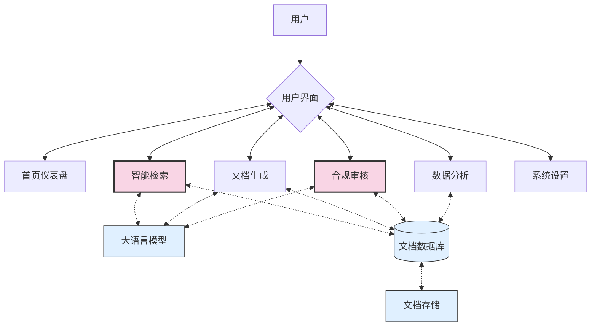

# 大模型文档系统信息架构设计

## 系统架构概述

本文档系统以"历史数据智能整理检索"和"文档合规审核"为核心功能，旨在帮助用户高效管理和利用大量历史文档资料，同时确保新生成的文档符合合规要求。

系统包含6个主要功能模块，其中智能检索模块和合规审核模块为核心功能模块（以特殊颜色标识）。系统支持四种用户角色：管理员、高级用户、普通用户和审计员，每种角色拥有不同的权限和访问范围。

## 功能模块详细结构

### 1. 首页仪表盘

### 2. 智能检索模块（核心功能1）

### 3. 文档生成模块

### 4. 合规审核模块（核心功能2）

### 5. 数据分析模块

### 6. 系统设置模块

## 用户角色与权限结构

## 数据流结构

本信息架构设计提供了大模型文档系统的总体结构和功能组织，重点突出了智能检索和合规审核两大核心功能模块，为系统开发和用户需求收集提供指导和参考。
