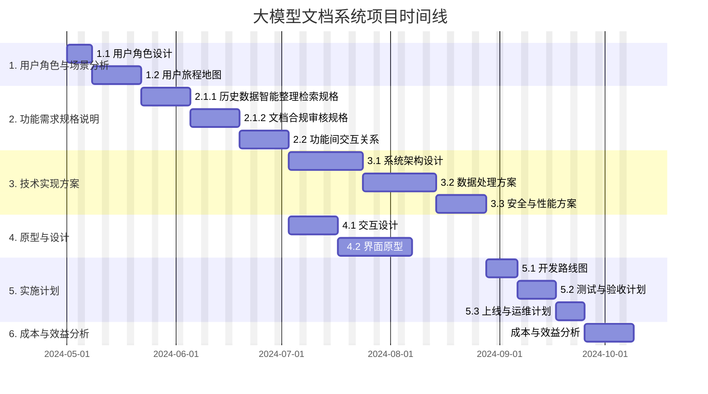

# 大模型文档系统 - 项目工作计划

## 一、项目概述

本项目旨在开发一套以"历史数据智能整理检索"和"文档合规审核"为核心功能的大模型文档系统，帮助用户高效管理和利用大量历史文档资料，同时确保新生成的文档符合合规要求。

## 二、工作计划与时间预估

### 1. 用户角色与场景分析（预计15个工作日）

#### 1.1 用户角色设计（5天）

- 用户基本特征与组织职责分析
- 使用系统的主要目标与动机梳理
- 对两大核心功能的依赖程度评估
- 技术熟练度与使用频率调研
- 可能面临的痛点与挑战分析

#### 1.2 用户旅程地图（10天）

- 历史数据检索旅程设计：从提出检索需求到获取有价值信息并应用的全过程
- 文档合规审核旅程设计：从文档创建到合规审核、修改建议和最终审批的完整流程
- 关键交互点和满意度评估模型设计

### 2. 功能需求规格说明（预计30个工作日）

#### 2.1 核心功能详细规格（20天）

**2.1.1 历史数据智能整理检索（10天）**

- 数据处理与存储规格制定
- 检索算法与关键技术规格确定
- 检索结果呈现与排序逻辑设计
- 知识关联与推荐机制设计
- 历史资料引用与追溯机制规范

**2.1.2 文档合规审核（10天）**

- 合规规则库设计与管理方案
- 自动检测算法与技术规格定义
- 问题标记与修改建议生成机制设计
- 审批流程与权限控制规范
- 合规报告与统计分析规格

#### 2.2 功能间交互关系（10天）

- 检索结果融入文档生成的机制设计
- 合规审核与文档修改的闭环流程设计
- 数据分析对两大核心功能的支持方式设计
- 各模块之间的数据流转与状态同步机制确定

### 3. 技术实现方案（预计40个工作日）

#### 3.1 系统架构设计（15天）

- 总体技术架构选型与设计：前后端分离架构、微服务架构或单体架构选择
- 核心组件技术选型：大模型接入方式、向量数据库、规则引擎等关键技术组件选择
- 扩展性设计：考虑未来功能扩展和数据增长的架构设计
- 技术栈确定与依赖关系分析

#### 3.2 数据处理方案（15天）

- 历史数据处理流程设计：数据清洗、结构化、索引建立
- 模型训练与优化方案：领域知识微调、检索增强生成（RAG）等
- 合规规则库构建流程：规则提取、形式化、更新机制
- 示例数据与测试数据准备

#### 3.3 安全与性能方案（10天）

- 数据安全方案设计：敏感信息处理、访问控制、审计日志
- 性能优化方案制定：大数据量检索优化、模型推理加速
- 灾备与恢复方案：数据备份策略、系统容灾方案
- 负载测试与性能基准设定

### 4. 原型与设计（预计25个工作日）

#### 4.1 交互设计（10天）

- 两大核心功能的关键交互流程设计
- 复杂功能的简化操作路径规划
- 错误处理与用户反馈机制设计
- 无障碍设计与用户体验增强方案

#### 4.2 界面原型（15天）

- 两大核心功能的高保真界面原型制作
- 关键页面的状态流转设计
- 响应式与移动适配方案开发
- 用户测试与原型迭代

### 5. 实施计划（预计20个工作日）

#### 5.1 开发路线图（7天）

- 分阶段实施计划制定（按优先级矩阵排序）
- 里程碑与交付物定义
- 资源需求与分配规划
- 风险评估与应对策略

#### 5.2 测试与验收计划（7天）

- 功能测试计划与案例设计
- 用户验收测试规划
- 性能与安全测试方案制定
- 质量保证体系建立

#### 5.3 上线与运维计划（6天）

- 部署方案与环境准备
- 数据迁移与初始化计划
- 运维监控与持续优化方案
- 培训与文档准备

### 6. 成本与效益分析（预计10个工作日）

- 开发与运维成本评估
- 预期业务价值与效益分析
- 投资回报周期估算
- 长期价值与可持续发展评估

## 三、项目甘特图

## 四、里程碑与交付物

| 里程碑             | 时间点     | 主要交付物                                         |
| ------------------ | ---------- | -------------------------------------------------- |
| M1: 需求与分析完成 | 2024-05-31 | 用户角色分析报告、用户旅程地图、功能需求规格说明书 |
| M2: 技术方案完成   | 2024-07-12 | 系统架构设计文档、数据处理方案、安全与性能方案     |
| M3: 原型验证完成   | 2024-07-26 | 交互设计文档、高保真界面原型、用户测试报告         |
| M4: 实施计划完成   | 2024-08-16 | 开发路线图、测试计划、上线方案、成本效益分析报告   |

## 五、团队配置与资源需求

### 5.1 核心团队成员

- 项目经理（1人）：全面负责项目规划与管理
- 产品经理（1人）：负责需求分析与产品设计
- 用户体验设计师（1人）：负责用户研究与界面设计
- 架构师（1人）：负责系统架构设计与技术选型
- AI工程师（2人）：负责大模型应用与训练
- 前端开发工程师（2人）：负责前端界面开发
- 后端开发工程师（3人）：负责后端功能开发
- 测试工程师（2人）：负责系统测试与质量保证
- 运维工程师（1人）：负责系统部署与运维

### 5.2 硬件与软件资源

- 开发环境服务器（4台）
- 测试环境服务器（2台）
- 生产环境服务器（待定，根据负载测试结果确定）
- 大模型训练与推理资源（高性能GPU服务器或云服务）
- 开发工具与软件许可证

## 六、风险评估与应对策略

| 风险类型 | 风险描述               | 可能性 | 影响程度 | 应对策略                                     |
| -------- | ---------------------- | ------ | -------- | -------------------------------------------- |
| 技术风险 | 大模型效果不满足预期   | 中     | 高       | 早期原型验证、备选方案准备、迭代优化计划     |
| 数据风险 | 历史数据质量与格式问题 | 高     | 高       | 数据质量评估、分批处理策略、数据清洗工具开发 |
| 进度风险 | 需求变更影响进度       | 中     | 中       | 变更控制流程、敏捷迭代方法、缓冲时间预留     |
| 资源风险 | 专业AI人才不足         | 中     | 高       | 提前招聘、外部专家咨询、内部培训计划         |
| 集成风险 | 与现有系统集成困难     | 中     | 中       | 早期接口测试、渐进式集成策略、兼容性设计     |

本项目计划总周期约为**140个工作日**（约7个月），从需求分析到实施计划完成。实际开发与部署阶段将根据实施计划另行安排。

## UI 优化实施总结

基于用户的两个核心需求，我们已对系统的几个关键页面进行了优化。具体内容如下：

### 1. 智能检索页面优化

**目标：** 强化AI对历史数据的组织和检索能力，提升用户检索体验

**实施内容：**
- 添加AI增强标识和功能说明，突出智能检索的核心能力
- 增加基于历史数据的智能推荐功能，提供更精准的搜索建议
- 新增AI检索建议区域，帮助用户优化搜索语句
- 添加历史数据整合选项，使AI能更好地分析和整合相关历史信息
- 增加搜索结果智能摘要功能，快速总结检索内容关键信息
- 优化知识图谱展示，更清晰地呈现AI对历史数据的整合和关联分析
- 添加基于历史数据分析的相关推荐功能

**效果：**
- 用户可更有效地利用历史数据进行检索
- 搜索体验更加智能化，减少检索时间
- 检索结果更加精准，并提供丰富的上下文关联信息

### 2. 文档生成页面优化

**目标：** 突出AI快速生成标准文件的能力，强化历史数据的智能利用

**实施内容：**
- 添加AI驱动标识和系统功能说明，明确系统核心价值
- 优化模板展示，增加AI优化标签和功能标签，方便用户选择
- 增加模板搜索功能，提升用户体验
- 添加历史数据利用说明，明确AI将分析历史文档提供智能建议
- 增强AI建议功能，显示建议来源于历史成功案例分析
- 优化AI内容生成提示，显示参考历史文档数量，增加可信度
- 改进预览区域，强调AI基于历史数据生成文档草稿的能力
- 添加历史记录功能，方便用户查看和参考相似文档

**效果：**
- 用户可以更高效地利用历史数据和标准模板生成文档
- 提供更个性化、更智能的内容建议
- 生成过程更透明，用户可了解AI决策依据

### 3. 系统设置页面优化

**目标：** 增强大模型配置功能，支持核心AI能力的定制与管理

**实施内容：**
- 突出大模型配置作为核心功能的重要性
- 添加模型性能评估指标，包括文档理解能力和合规检测准确率
- 新增模型参数配置区域，提供智能检索和合规审核的详细设置
- 增加历史数据聚合权重、检索深度、合规检测敏感度等关键参数调整功能
- 添加模型更新与设置应用按钮，便于管理员操作

**效果：**
- 管理员可以更精细地调整AI核心功能的参数
- 提供更透明的模型性能指标，便于评估和优化
- 支持针对不同业务场景的AI功能定制

### 4. 合规审核页面优化

**目标：** 强化AI对内部文档和合同的合规检查能力，突出风险识别和改进建议功能

**实施内容：**
- 增加AI合规审核标识，强调核心功能
- 优化合规检测流程和视觉呈现
- 增强合规问题展示，添加AI建议和改进措施
- 提供更详细的合规风险解释和法规依据
- 添加一键修复功能，提升用户体验

**效果：**
- 用户可更清晰地识别文档中的合规风险
- 提供更具操作性的改进建议
- 简化合规问题修复流程

### 总体效果

通过上述优化，系统在两个核心需求方面得到了显著增强：

1. **AI组织历史数据与文档生成**：系统现在能更高效地整理历史数据，提供智能检索，并快速生成标准文档，大幅提升工作效率。

2. **AI合规检查与建议**：系统增强了对内部文档和合同的合规性检查能力，能快速识别不合规内容并提供有针对性的改进建议。

这些优化不仅提升了系统的功能性，也改善了用户体验，使系统更加符合用户的实际需求。
